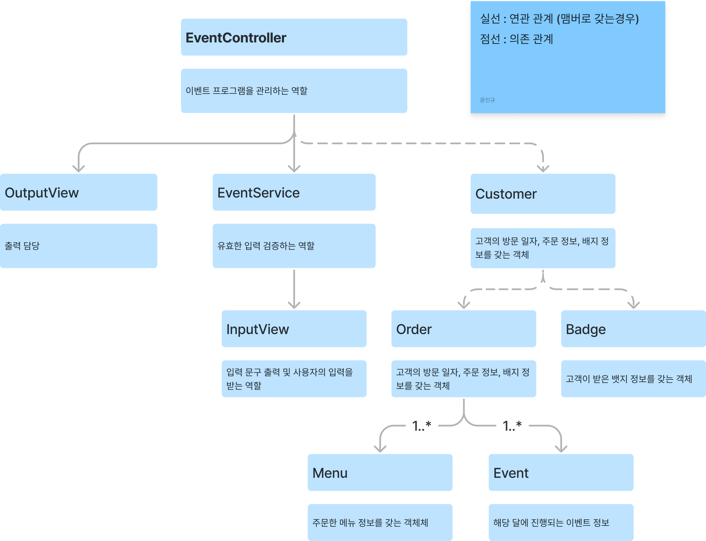

## 구현이 필요한 기능

1. 고객 정보를 관리
   1. 고객 방문 일자가 유효한지 체크

1. 주문한 메뉴 정보를 관리
   1. 고객이 주문한 메뉴의 총 가격을 계산하는 기능
   2. 20개를 초과하는지 검증하는 기능
   3. 메뉴의 개수가 1이상의 숫자인지 검증하는 기능
   4. 존재하지 않는 메뉴를 주문했는지 검증하는 기능
   5. 메뉴 형식이 예시와 같게 주문했는지 검증하는 기능
   6. 중복 메뉴를 입력했는지 검증하는 기능
   7. 음료만 주문한것은 아닌지 검증하는 기능

1. 할인을 관리
   1. 주문 금액이 총 10000원 이상인지 체크
   2. 크리스마스 디데이 할인이 가능한 시기인지 (1일 ~ 25일) 체크하는 기능
      1. 크리스마스 할인 대상 이라면 할인 금액이 얼마인지 계산하는 기능
   3. 방문 날짜가 평일인지 체크
      1. 주문한 메뉴가 `디저트 메뉴` 인지 확인
   4. 방문 날짜가 주말인지 체크
      1. 주문한 메뉴가 `메인 메뉴` 인지 확인
   5. 특별 할인을 받을 수 있는지 체크
      1. 일요일과 크리스마스 당일에 적용
   6. 증정 이벤트를 받을 수 있는지 체크
      1. 할인 전 총 주문 금액이 12만원 이상인 경우
   7. 각 할인 별 받은 혜택 금액과 총 혜택 금액을 계산하는 기능 

1. 총 혜택 금액 별 배지 관리
   1. 총 혜택 금액이 5천원 이상 `별`
   2. 총 혜택 금액이 1만원 이상 `트리`
   3. 총 혜택 금액이 2만원 이상 `산타`

## 실제 구현한 기능

1. Customer
   1. 고객이 입력한 방문 일자가 해당 달에 존재하는 일자인지 확인

2. Order
   1. 이벤트 명을 key, 적용 혜택 금액을 value로 하는 Map 생성
   2. 주문 내역 정보를 바탕으로 `메뉴명: 매뉴개수` 문자열을 담은 List<String> 생성
   3. 주문 내역 정보를 바탕으로 할인 전 총 주문금액 계산
   4. 총 주문 금액을 바탕으로 증정품 정보 생성
   5. 적용 혜택 금액이 0원 이상인 혜택 내역 생성
   6. 총 혜택 금액 계산
   7. 할인 후 지불 금액 계산
   8. 할인 금액 계산(증정품 혜택 금액을 제외)
   9. 총 혜택 금액을 통해 고객이 받을 뱃지 생성 

3. Menu
   1. 고객이 입력한 주문 정보를 바탕으로 메뉴를 key, 수량을 value로 하는 Map 생성
      1. `,` 구분자를 기준으로 메뉴별 주문 정보 분리
      2. `-` 구분자를 기준으로 메뉴 이름과 수량 정보 분리
      3. 입력한 메뉴 이름이 실제로 존재하는 메뉴 이름인지 확인
      4. 입력한 메뉴별 수량이 1이상 자연수인지 확인
      5. 음료만 주문하면 안되므로 확인
      6. 총 20개를 초과하여 주문하면 안되므로 확인

4. Event
   1. 주문 내역과 방문 일자를 기준으로 혜택을 받을 수 있는지 체크
   2. 이벤트 별 혜택 금액 계산

## 클래스 관계도

